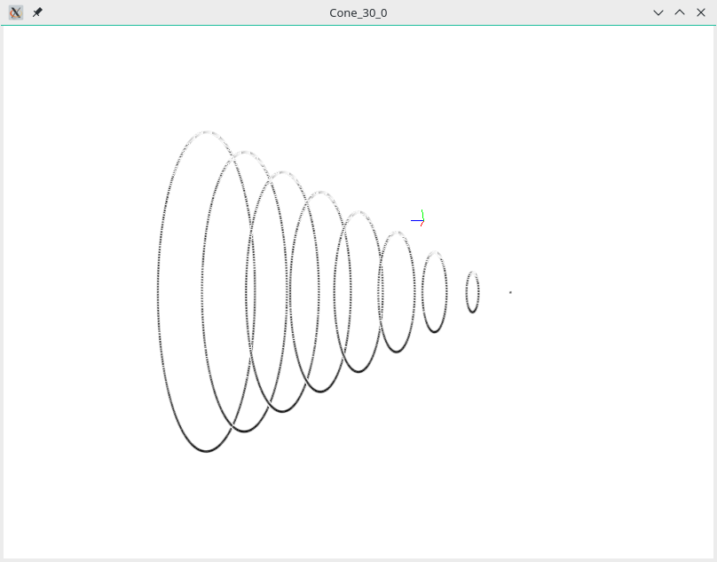

PyPlanScoring
=============

Introduction
------------

PyPlanScoring (PPS) package is software that calculates Dose Volume Histogram
(DVH) for plans generated by most commercially available Treatment Planning Systems (TPSs).
PPS was built extending the `dicompyler-core package: <https://github.com/dicompyler/dicompyler-core>`_ to perform structure volume
oversampling using dose trilinear interpolation, mainly in small structures. PPS was built initially
to evaluate plans submitted to the international radiotherapy plan competitions organized by
`Radiation Knowledge <https://radiationknowledge.org/>`_.

Motivation
----------

To develop a Python API to estimate DVHs and evaluate constraints metrics.
The main contribution is to implement structure volume up-sampling/oversampling.
Then, It improves the calculation accuracy on DVHs on small structures.
This API makes use of high-performance numerical libraries, such as `Scipy <https://www.scipy.org/>`_,
`Numpy <http://www.numpy.org/>`_
and `Numba <https://numba.pydata.org/>`_ which supports compilation of Python to run on either CPU or GPU hardware.
Most of critical code was implemented from scratch, e.g, dose-contour rasterization, DVH metrics
following the recommendations of `AAPM Report No. 263 - Standarizing Nomenclatures in Radiation Oncology (2018) <https://www.aapm.org/pubs/reports/RPT_263.pdf>`_.

The picture bellow shows a DVH calculated using a small cone,
3 mm slice size on 1D linear dose gradient.

.. image:: images/Cone_30_0_AP_3_mm.png

The dicompyler-core algorithm does not provide an accurate representation of this DVH.
On the other hand, PPS algorithm can be set to calculate oversampling
using voxels down to 0.1 mm :sup:`3` or less. Its results are in close agreement to `analytical values <http://dx.doi.org/10.1118/1.4923175>`_.

3D representation of an analytical cone structure with 3 mm slice thickness:

The collection of DVH test data is gently provided by `Canis Lupus LLC <http://canislupusllc.com/portfolio-curvecompare>`_
on the `link <http://canislupusllc.com/CurveCompare/DVH-Analysis-Data-Etc.zip>`_.
More details `here <http://scitation.aip.org/content/aapm/journal/medphys/42/8/10.1118/1.4923175>`_.

Where to from here?
--------------------

If you're new to this library, you can visit the :doc:`user manual <user_manual>`
page. If you're already familiar with this library, or you want to dive straight in, you
can jump to the Sphinx AutoAPI Index. You can also see the contents in the sidebar.

.. toctree::
    :maxdepth: 3
    :hidden:

    self
    user_manual
    contributing
