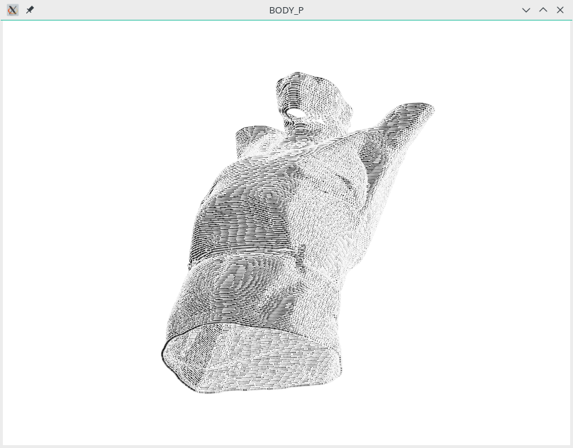
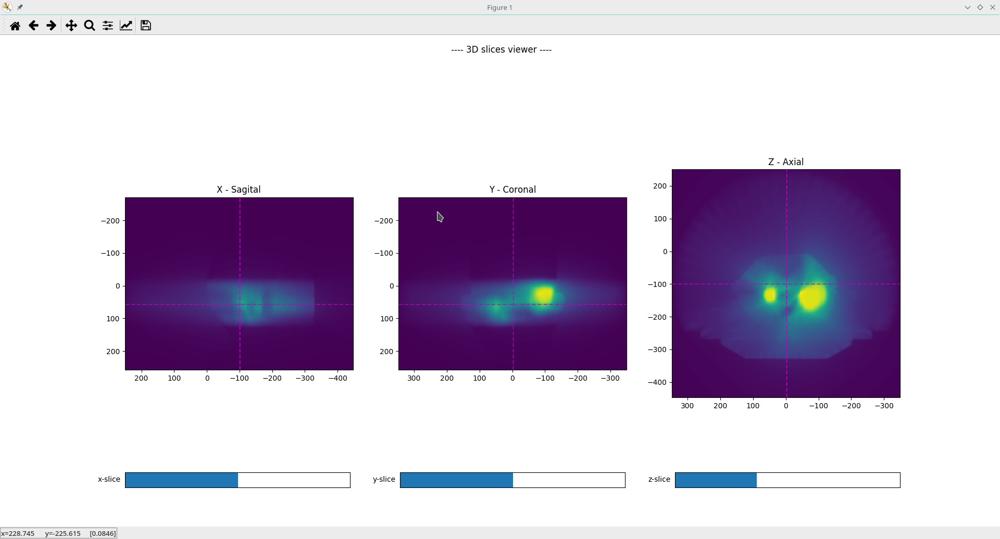

.. currentmodule:: pyplanscoring

DICOM-RT Parsing
================

PyPlanScoring inherited its dicom-parsing features from dicompyler-core `dicomparser <https://github.com/dicompyler/dicompyler-core/blob/master/dicompylercore/dicomparser.py>`_ module.
The class that encapsulates DICOM handling is :obj:`PyDicomParser`.

The method :obj:`PyDicomParser.GetStructures` returns a dictionary object that contains
each structure indexed by roi number as key.

.. code-block:: python

    from pyplanscoring import PyDicomParser, PyStructure

    rs_file = 'DICOM-RTStructure.dcm'
    rs_dcm = PyDicomParser(filename=rs_file)

    structures = rs_dcm.GetStructures()  # Dict like information of contours

PyPlanScoring provides the adapter class :obj:`PyStructure` to encapsulate methods
that are not available on the container object dictionary that is returned by
:obj:`PyDicomParser.GetStructures` method.

.. code-block:: python

    # encapsulate data on PyStructure object
    structure = PyStructure(structures[1])

It is also possible to visualize DICOM-Structure contours if `vispy <http://vispy.org>`_ package is installed.
There is a helper method from :mod:`pyplanscoring.vis.contours3d`.

.. code-block:: python

    from pyplanscoring.vis.contours3d import plot_structure_contours
    # encapsulate data on PyStructure object
    structure = PyStructure(structures[1])
    plot_structure_contours(structure.point_cloud, structure.name)

Example result of body contours extracted from DICOM-Structure file.

PyPlanScoring provides methods to handle DICOM-RTDOSE files. The class :obj:`pyplanscoring.core.types.Dose3D`
adds a layer of abstraction on top of the dose-matrix provided by RTDOSE files.
This class implements :obj:`scipy.interpolate.RegularGridInterpolator` to provide trilinear dose interpolation
on regular grid coordinates.

There is a factory class :obj:`pyplanscoring.DoseAccumulation` to provide plan-sum capabilities,
by using operator overloading on :obj:`pyplanscoring.core.types.Dose3D`

It is possible to visualize axial, coronal and sagittal slices from a Dose3D matrix.

.. code-block:: python

    from pyplanscoring import PyDicomParser, DoseAccumulation
    from pyplanscoring.vis.slice3 import DoseSlice3D

    dose_files = ["Plan1_dose.dcm", "Boost.dcm"]

    rd_dcm = [PyDicomParser(filename=dose_file) for dose_file in dose_files]
    doses_obj = [d.get_dose_3d() for d in rd_dcm]

    # using factory class to add 3d doses matrix
    acc = DoseAccumulation(doses_obj)
    dose_sum = acc.get_plan_sum()

    # View the result
    dose_view = DoseSlice3D(dose_sum)
    dose_view.show()

Example result:

