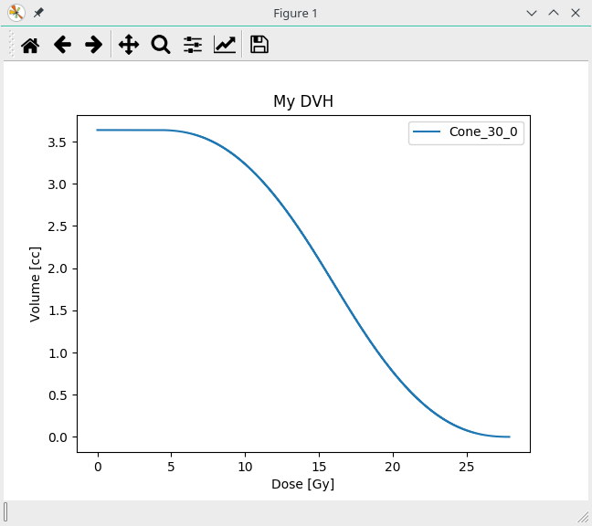

.. currentmodule:: pyplanscoring

Getting Started
===============

This section is going to provide basic applications of :obj:`pyplanscoring` API.
The main functionality is encapsulated on :obj:`PyPlanScoringAPI` class.

Its constructor receives paths to DICOM-RTStructure and RT-DOSE files.
These files are commonly exported by most of radiotherapy planning Systems - TPS.

The method :obj:`PyPlanScoringAPI.get_structure_dvh` returns a dictionary with
a calculated cummulative DVH in absolute volumes [cc].

It is also possible to save calculated DVHs in JavaScript Object Notation (JSON) files.
Just using the class :obj:`IOHandler`.

.. code-block:: python

    from pyplanscoring import PyPlanScoringAPI, plot_dvh, plot_dvhs, IOHandler
    # DVH calculation use-case
    # RS file
    rs_file = 'RT-Structure.dcm'
    # RD file
    rd_file = 'RT-DOSE.dcm'

    pp = PyPlanScoringAPI(rs_file, rd_file)

    #calculation parameters
    end_cap_size = 1.5 # mm
    calc_grid = (0.1, 0.1, 0.1)  # mm3

    # calculating one structure DVH using roi_number
    dvh = pp.get_structure_dvh(roi_number=2, end_cap=end_cap_size, calc_grid=calc_grid)

    # plotting DVH
    plot_dvh(dvh, 'My DVH')

    # calculating DVH from all strucures in RT-structure file - no oversampling
    dvhs = pp.calc_dvhs(verbose=True)

    # Plotting all DVHs in relative volumes
    plot_dvhs(dvhs, 'PyPlanScoring')

    # saving results in JSON text
    obj = IOHandler(dvhs)
    output_file_path = 'plan_dvhs.dvh'
    obj.to_json_file(output_file_path)

This example shows a result using oversampling by setting
the calculation grid size (dx, dy, dz) in mm.

Excample result:

That's it! You can move on to the :doc:`user manual <../user_manual>` to see what
part of this library interests you.
